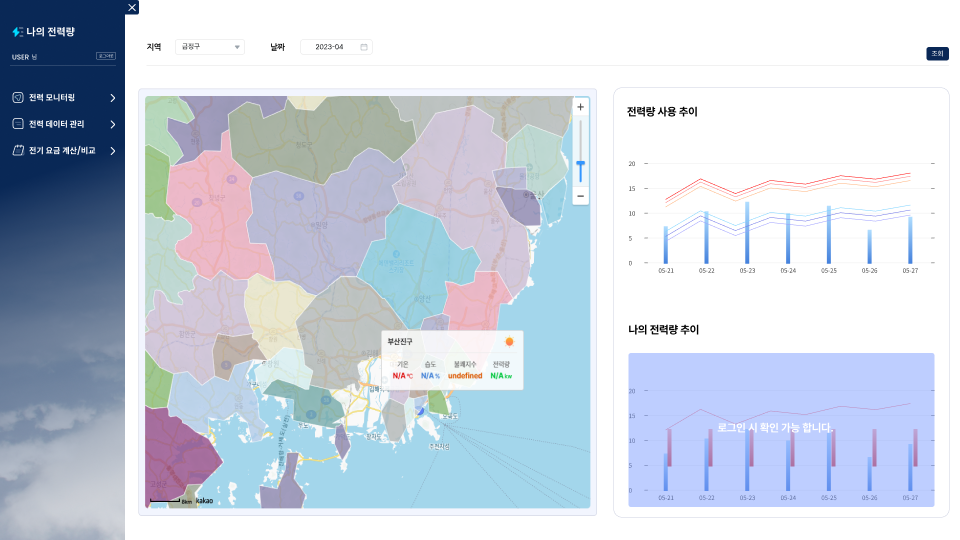

## ⚡ 나의 전력량 (24.07.28 - 24.08.25)
> #### 
> #### 행정구역에 따른 날씨 및 전력량 관리 및 전기 요금 계산 서비스 : Frontend 담당
> - 주요 컨텐츠 : 우리집 전력량 관리, 지도를 통해 행정구역에 따른 날씨 및 전력량 정보 제공, 월별 평균사용량 차트
> - 한국전력공사, 기상청 공공 데이터 활용
> - [PPT 보러가기](https://drive.google.com/drive/folders/1-a2fFd3H7AS8LuBA-HYXWhqX8SVNGCFf?usp=drive_link)

 

## :wrench: 개발 환경
>`React(18.2.0)`
`Java(17.0.10)`
`JDK(17.0.10)`
`Springboot(6.1.11)`
`MySQL(8.0.37)`

 

## :bulb: 주요 기능
  ### 1. 로그인 
 > 
- Request에 가입에 필요한 username, password and email을 담아 요청

 > 
- 가입 성공 시, 로그인 페이지로 이동할 수 있는 경로 제공

 > 
- 가입 실패 시, alert에 가입 실패 이유 표출

 

### 2. 회원가입/탈퇴 
> 
- Request에 username과 password를 JSON 형태로 요청

> 
- Response에서 JWT를 추출해 Logout 전까지 모든 Request에 JWT를 포함시켜 요청 

> 
- Login 성공 시 DashBoard의 개인 차트 열람 가능

> 
- 회원 탈퇴 요청 확인 후 사용자 정보와 토큰 제거 후 로그인 페이지로 리다이렉트

 

### 3. 전력 모니터링
> 
- 카카오맵 API 활용

> 
- 지도를 행정구역별로 구분(Coloured Polygons)

> 
- 지도 클릭 시 해당 날짜의 일별 전력 사용량 및 기상 정보 Pop-up

> 
- 일, 주, 월 단위의 일별 전력 사용량 및 기상 정보를 Chart로 표출

> 
- 로그인 시 개인별 전력정보 Chart로 확인 가능

 

### 4. 전력 데이터 관리
> 
- 자신의 전체 정보 및 기간 / 행정구역 / 전력 사용량 범위로 검색 가능

> 
- 정보 추가를 위한 행 추가(추가 button)

> 
- 기존 행 수정 시 체크박스 자동으로 ON

> 
- 저장 버튼 클릭 시 추가 & 수정 한번에 처리

> 
- 페이지 당 보여지는 게시물 수 조정

 

### 5. 전기 요금 계산/비교
> 
- 사용자의 전력 사용량을 달력에 출력 ( + 해당 날짜 메모 유무 표시)

> 
- 사용 시작 날 기준으로 해당 달, 이전 달 전력요금 계산

> 
- 달력에서 날짜 선택 시, 해당 일의 기상정보, 전력 사용량, 메모 (존재 시) 를 우측 상단에 표출

> 
- 우측 하단에서 행정구역 선택 시, 해당 구역의 가구별 평균 전력 요금 조회 가능 

 

### 6. 관리자
> 
- 사용자의 Role 확인 후 ‘admin’ 일 경우 접근 가능. 접근 권한 없을 경우 모니터링 화면으로 리다이렉트

>
 

## :page_with_curl: 개발일지

| PERIOD | SUBJECT | 
| ------- | ------- |
| **2024.07.28** | **Login 구현** | 
| **2024.07.29** | **Layout 구조 잡기** | 
| **2024.08.01** | **Router 정리 / Menu data 생성** | 
| **2024.08.04** | **KakaoMap api 연동** | 
| **2024.08.05** | **InputBox, Btn 컴포넌트 정리 / Header 수정** | 
| **2024.08.06** | **KakaoMap 행정구역 단위 폴리곤 생성 / 지역선택 버그 수정** | 
| **2024.08.07** | **KakaoMap zoomControl 구현 / E-Chart를 통해 mockUp 데이터 연결** | 
| **2024.08.08** | **KakaoMap 클릭 이벤트 수정 (CustomOverlay) / 로그인 유/무 기능 적용** | 
| **2024.08.12** | **차트와 Backend api 연동** | 
| **2024.08.13** | **레이아웃 수정 / 필수입력 값 누락 시 focusing 기능 구현 / CRUD 구현 / Alert 전역에 구현** | 
| **2024.08.14** | **Back과 로그인 Api 연동 / 삭제 기능 구현** | 
| **2024.08.19** | **SideNav 구현 / Calendar 구현** | 
| **2024.08.20** | **회원가입 구현** | 
| **2024.08.21** | **관리자 화면 구현 / Pagenation 구현 / 회원탈퇴 구현** | 
| **2024.08.22 - 08.25** | **기능 테스트 및 버그 수정** | 
